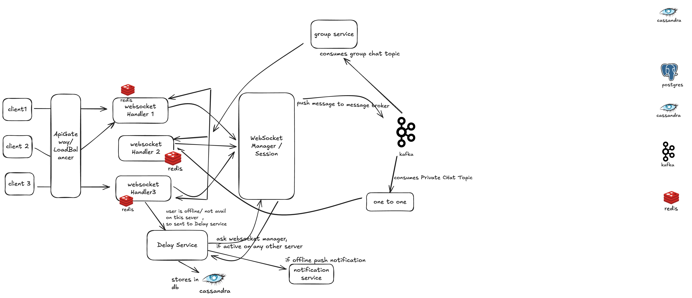

# ChatApplication 🚀

A **Distributed, real-time chat application** built with **Java, Spring Boot 3**, **Kafka**, **Redis**, and **PostgreSQL**. This application supports multi-node deployment for **high scalability, fault tolerance, and low-latency real-time messaging**.

## Live Features

- **Authentication & Authorization:** Secure login and access control using **Spring Security**.
- **1-to-1 Messaging:** Private messages with **Sent, Delivered, Seen** statuses.
- **Group Messaging:** Fan-out delivery for real-time group chats across nodes.
- **Online/Offline Status & Last Seen:** Track user presence and last activity.
- **Typing Indicator:** Show when users are typing in real-time across nodes.
- **Notifications:** Real-time notifications for messages and events.
- **Heartbeat Monitoring:** Continuously monitor client connections for reliability.
- **Cross-Node Delivery:** Messages are reliably delivered across multiple application instances.
- **Fault Tolerance:** Retry queues, dead-letter topics, and message acknowledgments with timeouts.
- **Dockerized Deployment:** Easily deploy multiple nodes and infrastructure with **Docker Compose**.

---

## System Architecture

This application leverages a **distributed, fault-tolerant architecture** to handle real-time chat at scale. Key design components include:

### 1. **Redis Streams**
- Used for tracking **online/offline status**.
- Each user’s `user:username:lastSeen` is stored in Redis.
- **Spring Batch jobs** periodically persist **last seen** timestamps to PostgreSQL for long-term storage.

### 2. **Redis Pub/Sub**
- Handles **typing indicators** in real-time across nodes.
- Ensures that typing events are broadcast to all relevant users immediately.

### 3. **1-to-1 Messaging**
- Messages are published to a **Kafka DM delivery topic**.
- If the recipient is present on the **local node**, the message is delivered directly.
- Otherwise, the message is forwarded to an **inter-node delivery topic** for cross-node delivery.
- **Read receipts** are published to a separate **Kafka read-receipt topic** for reliable acknowledgment.

### 4. **Group Messaging**
- Managed by an **asynchronous worker**.
- Performs a **fan-out service**: messages are delivered to all online users across nodes and notifications are sent to offline users.
- Messages are cached in Redis and persisted in PostgreSQL for reliability.

### 5. **Reliability & Fault Tolerance**
- **Retry queues:** Automatically retry failed message deliveries and read receipts.
- **Dead Letter Topics (DLT):** Handle undeliverable messages for future inspection.
- **Message acknowledgment with timeout:** Ensures that no messages are lost if delivery fails.
- **Heartbeat monitoring:** Detects disconnected clients and handles reconnections gracefully.

### 6. **Cross-Node Delivery**
- Kafka topics handle **distributed messaging** between nodes.
- Redis and Kafka ensure **eventual consistency** across all nodes.
- Supports **multi-node deployments** for horizontal scalability.

# My ChatApplication High Level Design


---

## Tech Stack

| Layer                | Technology |
|----------------------|------------|
| Backend              | Spring Boot 3, Spring Security |
| Real-Time Messaging  | WebSockets, Redis Pub/Sub |
| Messaging Queue      | Apache Kafka |
| Caching & Streams    | Redis Streams |
| Database             | PostgreSQL |
| Containerization     | Docker, Docker Compose |
| Build & Dependency   | Maven |

---

## Getting Started

### Prerequisites

- Docker & Docker Compose installed
- Java 17+
- Maven 3.9+
- Postman (or any REST client for testing APIs)

## 🐳 Docker Setup

The application is fully **Dockerized** for multi-node testing:

- **Services**:
    - `chat-app-1` (Spring Boot Application Node 1)
    - `chat-app-2` (Spring Boot Application Node 2)
    - `kafka`
    - `zookeeper`
    - `redis`
    - `postgres`

- **Run the multi-node setup**:

```bash
docker-compose up --build


### Api Examples via  Postman
-user A - http://usera.localhost:8080/api/v1/auth/Signin
-ws://usera.localhost:8080/ws/chat

UserB - http://usern.localhost:8081/api/v1/auth/refresh-token
ws://usera.localhost:8080/ws/chat

Postman saves cookies based domain thats why usera.localhost and usern.localhost


